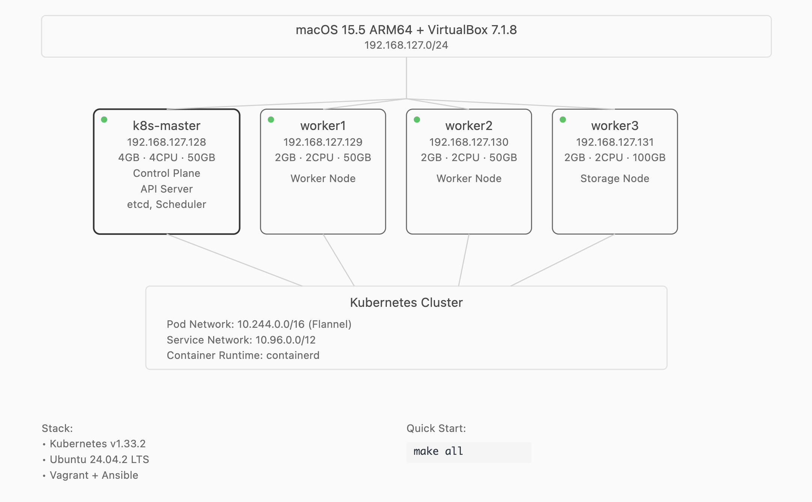

# Kansible - Kubernetes 클러스터 자동 구성

Vagrant와 Ansible을 사용하여 다중 노드 Kubernetes 클러스터를 자동으로 구성하는 프로젝트입니다.

## 실행 환경 및 요구사항

### 소프트웨어 요구사항
- **VirtualBox 7.1+** (ARM64 지원)
- **Vagrant 2.3+**
- **Ansible 2.9+**
- **기타**: `git`, `curl`

> **Note**: AMD64/Intel (x86_64) 아키텍처 사용자 안내
> 
> 이 프로젝트는 Apple Silicon (ARM64) 환경에서 기본 설정되어 있습니다. 만약 AMD64/Intel 기반의 호스트를 사용하신다면, `Vagrantfile`의 `config.vm.box` 설정을 자신의 환경에 맞는 Box로 변경해야 합니다.
> 
> ```ruby
> # Vagrantfile
> config.vm.box = "net9/ubuntu-24.04-arm64" # 이 부분을 amd64용 Box로 변경
> ```
> 
> 호환되는 Box는 [Vagrant Cloud](https://portal.cloud.hashicorp.com/vagrant/discover)에서 `ubuntu` 등으로 검색하여 찾을 수 있습니다. (예: `ubuntu/noble64`)
> 
> Ansible 플레이북은 아키텍처를 자동으로 감지하므로 별도의 수정이 필요 없습니다.

### 하드웨어 요구사항
- **RAM**: 최소 12GB (호스트 4GB + 클러스터 8GB)
- **디스크**: 최소 20GB 여유 공간
- **CPU**: 4코어 이상 권장

## 설치 및 설정

## 🚀 빠른 시작

모든 준비가 완료되었다면, 다음 명령어 하나로 전체 클러스터를 생성하고 구성할 수 있습니다.

```bash
git clone https://github.com/kimhxsong/kansible
make all
```

## 📚 주요 명령어 (Makefile 기반)

- **전체 클러스터 생성 및 구성:**
  ```sh
  make all
  ```
- **VM만 생성 및 부팅:**
  ```sh
  make up
  ```
- **정적 IP 및 /etc/hosts 네트워크 설정:**
  ```sh
  make network
  ```
- **네트워크 + 쿠버네티스 클러스터 구성:**
  ```sh
  make cluster
  ```
- **VMs 리셋 후 재구성:**
  ```sh
  make re
  ```
- **클러스터만 리셋:**
  ```sh
  make reset
  ```
- **모든 VM 중지:**
  ```sh
  make down
  ```
- **모든 VM 삭제:**
  ```sh
  make clean
  ```

## 📝 일반적인 워크플로우 예시

- **최초 환경 구성:**
  ```sh
  make all
  ```
- **중단했던 환경 다시 시작:**
  ```sh
  make up
  ```
- **네트워크만 재설정:**
  ```sh
  make network
  ```
- **클러스터만 리셋:**
  ```sh
  make reset
  ```
- ** VMs 삭제 후 클러스터 재구성:**
  ```sh
  make re
  ```
- **일시 정지:**
  ```sh
  make down
  ```
- **완전 삭제:**
  ```sh
  make clean
  ```

## 🐛 문제 해결

### VM 부팅 또는 SSH 연결 실패
- **해결책 1: VM 재시작**
  ```bash
  make down && make up
  ```
- **해결책 2: 수동 SSH 연결 테스트**
  ```bash
  vagrant ssh k8s-master
  ```
  이때 발생하는 오류 메시지를 확인하여 문제를 진단합니다.

### 클러스터 구성 실패
- **해결책 1: 클러스터 완전 초기화 후 재구성**
  ```bash
  make re
  ```
- **해결책 2: Kubelet 로그 확인**
  마스터 노드에 접속하여 `sudo journalctl -u kubelet -f` 명령어로 실시간 로그를 확인합니다.
  ```bash
  vagrant ssh k8s-master -c "sudo journalctl -u kubelet -f"
  ```

### 네트워크 연결 문제
- **노드 간 Ping 테스트:**
  ```bash
  vagrant ssh k8s-master -c "ping k8s-worker1"
  ```
- **라우팅 테이블 확인:**
  ```bash
  vagrant ssh k8s-master -c "ip route"
  ```

## ⚙️ 기술 사양

### 개발 환경
- **호스트 OS**: macOS 15.5 (24F74) - Apple Silicon (ARM64)
- **VirtualBox**: 7.1.8r168469
- **게스트 OS**: Ubuntu 24.04.2 LTS Server (ARM64)
- **VM Box**: net9/ubuntu-24.04-arm64 v1.1
- **ISO**: ubuntu-24.04.2-live-server-arm64.iso

### 소프트웨어 버전
- **Kubernetes**: v1.33.2 (2024년 12월 기준 최신 안정 버전)
  - Ansible 플레이북이 `https://dl.k8s.io/release/stable.txt`에서 최신 안정 버전을 자동으로 가져옴
  - kubelet, kubeadm, kubectl 모두 동일한 버전으로 설치
- **Container Runtime**: containerd (Ubuntu 패키지 저장소)
- **CNI**: Flannel (최신 릴리즈 버전)
- **Ansible**: 2.9+ (호스트에 설치)

### 클러스터 아키텍처


### 네트워크 구성
- **호스트 전용 네트워크**: 192.168.127.0/24
- **Pod CIDR**: 10.244.0.0/16 (Flannel CNI)
- **서비스 CIDR**: 10.96.0.0/12

### Ansible 플레이북 구조
- **`configure-network.yml`**: 네트워크 설정
- **`configure-cluster.yml`**: 클러스터 전체 구성 (공통 설정, 마스터 초기화, 워커 조인)
- **`reset-cluster.yml`**: 클러스터 초기화

## 📦 Vagrant Box vs ISO 이미지 사용 안내

현재 프로젝트는 Vagrant Cloud의 box 이미지를 그대로 사용합니다. 이 방식은 이미 OS가 설치된 상태의 가상머신 이미지를 복사해서 바로 부팅하므로 설치 속도가 매우 빠릅니다.

만약 사용자가 직접 ISO 이미지를 사용하고 싶다면, Vagrantfile의 관련 주석을 해제하고 medium 옵션(예: `--medium ./ubuntu-24.04.2-live-server-arm64.iso`)을 직접 지정해야 합니다. 이 경우, VM 부팅 후 OS 설치 과정을 처음부터 자동으로 진행하므로 box 방식에 비해 시간이 훨씬 오래 걸립니다.

> **Tip:** 특별한 커스텀 이미지가 필요하지 않다면, Vagrant Cloud의 box를 그대로 사용하는 것이 훨씬 빠르고 편리합니다. ISO로 직접 설치하는 것은 커스텀 빌드나 특수한 환경이 필요할 때만 권장됩니다.

## 📖 참고 자료

- [Kubernetes 공식 문서](https://kubernetes.io/docs/)
- [Vagrant 공식 문서](https://www.vagrantup.com/docs)
- [Ansible 공식 문서](https://docs.ansible.com/)

## 🧩 이후에 해볼만한 시도들

- **Custom GUI 툴 개발**  
  클러스터 관리 및 배포를 위한 자체 GUI 툴을 만들어 자동화 경험을 확장

- **Packer를 이용한 커스텀 Vagrant Box 제작**  
  Packer로 직접 커스텀 이미지를 빌드하여 Vagrant Box로 활용

- **Kubespray로 AMD64 아키텍처 클라우드 환경에 클러스터 구성 및 배포**  
  Kubespray를 활용해 퍼블릭 클라우드(AWS, GCP 등)나 x86 환경에서의 자동화 실습

- **CoreDNS, CNI 관련 내용 정리**  
  CoreDNS와 다양한 CNI(Flannel 등) 구성 및 동작 원리 문서화

